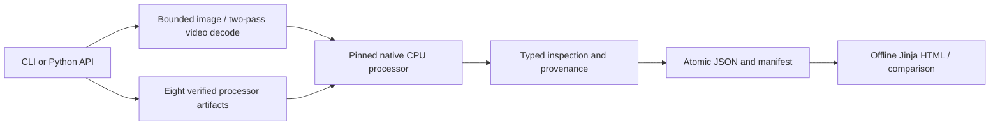

# Architecture

## Implemented CPU workflow

`inspect.inspect_media(InspectionConfig)` is shared by CLI and Python callers.
`artifacts` permits one immutable allowlist without weights or remote code.
`media` validates local files, hashes originals, applies EXIF/RGB handling, selects
frames and records PTS/padding. `adapters` owns the one verified model path, native
resize/preprocessing and exact token accounting. `schemas` validates versioned
records. `storage` reads bounded JSON and publishes complete run directories;
`report` renders the same typed evidence and checks comparison compatibility.

Heavy dependencies load only when inspection runs. CLI help, prepare, reading
stored JSON, rendering and comparing use the base package: Typer/Rich, Pydantic
and Jinja2. The inspect extra pins Transformers, CPU-capable Torch/torchvision,
Pillow and PyAV. Hatchling includes templates, allowlist data and `py.typed`.
No FFmpeg shell executable, GPU or model weights are needed on the tested Mac.

See [ADR 0003](decisions/0003-cpu-inspection.md) for the single native processor
call, staged video selection, resource admission limits and timestamp semantics.
The source/code/tests are concrete modules; no speculative registry is present.

## Future boundaries

M3 will add a separate HTTPX transport and protocol measurement module. M4 must
validate that transport on an owner-provided endpoint. It must preserve CPU
processor verification separately from server parity. Telemetry/profiling stays
optional and later; neither exists in the CPU inspector. No backend, database,
web service, paid infrastructure or arbitrary remote-media fetch is introduced.
