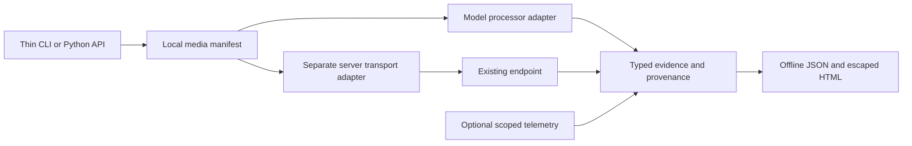

# Architecture

## Current implementation

The package contains `__init__.py` (version), `cli.py` (Typer entry point),
`schemas.py` (Pydantic evidence foundation), and `py.typed`. The CLI imports no
processor, decoder, tensor runtime, or model. No empty future packages are created.

Hatchling builds the `src/` package. Ruff and mypy check source and tests; uv locks
contributor dependencies. Typer/Rich provide argument parsing and readable help;
Pydantic validates stored evidence. HTTPX will be added with the M3 client and
Jinja2 as a direct base dependency with M2 stored-report rendering. Their future
use is not a reason to install them in the M0 base environment.

The `[inspect]` extra has a pinned feasibility tuple including CPU-capable Torch,
torchvision, Transformers, Pillow, and PyAV. It is not a working inspect command.
See [ADR 0002](decisions/0002-processor-path.md) for the authoritative path and
[ADR 0001](decisions/0001-foundation.md) for packaging and platform constraints.

## Intended flow and extension boundaries

All nodes after the CLI are planned beyond the evidence foundation. Model adapters
own processor capability/configuration and token semantics; server adapters own
transport, usage/stream capability and parity. Add another adapter only with a
real fixture, source references and an explicit support tuple. No registry/plugin
framework is needed for one concrete adapter.

### 3.2 Boundaries

| Area | Responsibility |
| --- | --- |
| `schemas` | Versioned input, inspection, measurement, comparison, and provenance records. |
| `media` | Local file validation, metadata, hashing, decoding, sampling, thumbnails. |
| `adapters` | Model-specific processing and separately defined backend request capabilities. |
| `inspect` | Coordinate media manifest and processor evidence without loading model weights. |
| `benchmark` | HTTP streaming, workload control, timing, usage accounting, run persistence. |
| `telemetry` | Optional server/per-request/device observations with explicit scope. |
| `analysis` | Derived metrics, comparability checks, evidence-based rules. |
| `report` | Deterministic JSON export and portable HTML rendering. |
| `cli` | Thin argument parsing and presentation around the Python API. |

Represent these as simple modules first. Split packages when real code warrants it. Do not create dozens of empty files or pretend deferred modules are implemented.

The processor adapter should expose capabilities, load the allowed processor/config artifacts, process a known media manifest, and return evidence plus effective configuration. The server adapter should state its supported modalities, accepted media transport, streaming/usage capabilities, and parity status. Keep these adapters separate so a model family does not become inseparable from one server engine.

## Resource and privacy boundaries (implementation gates)

M1 must bound local input size, decoded pixels and tensor budget before expensive
work. M2 must bound decoded frames/memory and output/report size, account for PTS,
and write artifacts atomically with explicit overwrite. M3 must enforce HTTP and
subprocess deadlines, concurrency, cancellation, redaction and complete request
attempt persistence. None of these future safeguards is advertised as implemented
in M0. No arbitrary remote media, remote executable processor code, model weights,
public service, database, or paid infrastructure belongs in the initial path.
